# Curso Avanzado: Python para LLMs y Chatbots

## 🚀 Descripción General

Este curso está diseñado para desarrolladores que desean profundizar en la implementación de sistemas de Inteligencia Artificial basados en Modelos de Lenguaje de Gran Escala (LLMs). A través de un enfoque práctico, los participantes aprenderán a construir chatbots avanzados utilizando técnicas de Retrieval-Augmented Generation (RAG), trabajar con bases de datos vectoriales, y desplegar aplicaciones de IA en entornos de producción.

## 🎯 Objetivos del Curso

- **Entender toda la potencialidad de la plataforma de OpenAI**:
  - Diferencias entre GPTs y Asistentes
  - Uso avanzado de la API

- **Dominar la implementación de sistemas RAG** utilizando:
  - API de OpenAI
  - LangChain como framework de integración

- **Comprender y aplicar técnicas de fine-tuning** para modelos de lenguaje

- **Desarrollar chatbots avanzados** con capacidades de recuperación de información contextual

- **Implementar bases de datos vectoriales con FAISS** para búsqueda semántica eficiente

- **Desplegar aplicaciones de IA** en plataformas como:
  - Streamlit para interfaces de usuario
  - AWS EC2 para entornos de producción

## 📋 Requisitos Previos

- **Conocimientos básicos de Python y ChatGPT**
  - Idealmente conocer ChatGPT y la plataforma de OpenAI

- **Cuenta en OpenAI con acceso a API**
  - Se proporcionarán instrucciones para configurarla durante el curso

- **Deseable pero no imprescindible**: cuenta de GitHub
  - Se puede crear durante el curso

- **Opcional**: cuenta en AWS u otro proveedor de cloud
  - Útil para la sección de despliegue

## 📚 Estructura del Curso

El curso está organizado en 8 sesiones distribuidas en 2 semanas:

### Semana 1
- **Jueves**: Introducción y Configuración del Entorno
- **Viernes**: Fundamentos de LLMs y Chatbot Básico
- **Sábado**: Introducción a RAG y Bases de Datos Vectoriales
- **Domingo**: Implementación de RAG con OpenAI

### Semana 2
- **Jueves**: Fundamentos de LangChain
- **Viernes**: RAG Avanzado
- **Sábado**: Fine-tuning y Streamlit
- **Domingo**: Proyecto Final y Despliegue

```mermaid
flowchart TD
    subgraph Semana1[Semana 1]
        A1[Jueves: Introducción y Configuración] --> A2[Viernes: Fundamentos LLMs y Chatbot Básico]
        A2 --> A3[Sábado: Intro a RAG y Bases de Datos Vectoriales]
        A3 --> A4[Domingo: Implementación RAG con OpenAI]
    end

    subgraph Semana2[Semana 2]
        B1[Jueves: LangChain Fundamentals] --> B2[Viernes: RAG Avanzado]
        B2 --> B3[Sábado: Fine-tuning y Streamlit]
        B3 --> B4[Domingo: Proyecto Final y Despliegue]
    end

    A4 --> B1

    subgraph Fundamentos[Fundamentos Técnicos]
        F1[Git y GitHub]
        F2[Python y Entorno]
        F3[APIs y Tokens]
    end

    subgraph Componentes[Componentes Clave]
        C1[Embeddings]
        C2[Bases de Datos Vectoriales]
        C3[Recuperación de Información]
        C4[Prompt Engineering]
        C5[LLMs Locales]
    end

    subgraph Tecnologías[Tecnologías]
        T1[OpenAI]
        T2[LangChain]
        T3[FAISS]
        T4[Streamlit]
        T5[HuggingFace]
    end

    Fundamentos -.-> A1
    Componentes -.-> A3
    T1 -.-> A2
    T2 -.-> B1
    T3 -.-> A3
    T4 -.-> B3
    T5 -.-> A2
    T5 -.-> C1
    T5 -.-> C5

    %% Definición de estilos con texto negro
    classDef week1 fill:#f9d5e5,stroke:#333,stroke-width:1px,color:#000
    classDef week2 fill:#eeeeee,stroke:#333,stroke-width:1px,color:#000
    classDef fundamentos fill:#e3f2fd,stroke:#333,stroke-width:1px,color:#000
    classDef componentes fill:#e8f5e9,stroke:#333,stroke-width:1px,color:#000
    classDef tecnologias fill:#fff3e0,stroke:#333,stroke-width:1px,color:#000

    %% Aplicación de estilos
    class A1,A2,A3,A4 week1
    class B1,B2,B3,B4 week2
    class F1,F2,F3 fundamentos
    class C1,C2,C3,C4,C5 componentes
    class T1,T2,T3,T4,T5 tecnologias

    %% Estilos adicionales para mejorar legibilidad
    classDef default color:#000,font-weight:bold

    %% Estilo para las etiquetas de los subgráficos
    classDef subgraphTitle color:#fff,font-weight:bold,font-size:22px
    class Semana1,Semana2,Fundamentos,Componentes,Tecnologías subgraphTitle
```

El cronograma del curso muestra cómo este módulo encaja en la secuencia de aprendizaje:

```mermaid
gantt
    title Cronograma del Curso: Python Avanzado para LLMs y Chatbots
    dateFormat  YYYY-MM-DD
    axisFormat %d-%m
    todayMarker off

    section Semana 1
    Introducción y Configuración             :s1_1, 2025-01-01, 1d
    Fundamentos LLMs y Chatbot Básico        :s1_2, after s1_1, 1d
    Intro a RAG y Bases de Datos Vectoriales :s1_3, after s1_2, 1d
    Implementación RAG con OpenAI            :s1_4, after s1_3, 1d

    section Semana 2
    LangChain Fundamentals                   :s2_1, 2025-01-08, 1d
    RAG Avanzado                             :s2_2, after s2_1, 1d
    Fine-tuning y Streamlit                  :s2_3, after s2_2, 1d
    Proyecto Final y Despliegue              :s2_4, after s2_3, 1d

    section Tecnologías
    GitHub & Python        :tech1, 2025-01-01, 1d
    OpenAI API             :tech2, 2025-01-02, 3d
    HuggingFace (LLM Local):tech5a, 2025-01-02, 1d
    HuggingFace (Embeddings):tech5b, 2025-01-03, 1d
    FAISS                  :tech3, 2025-01-03, 2d
    LangChain              :tech4, 2025-01-08, 2d
    Streamlit              :tech6, 2025-01-10, 2d

    section Componentes Clave
    LLMs Básicos           :comp1, 2025-01-02, 1d
    Chatbot Local          :comp2, 2025-01-02, 1d
    Embeddings             :comp3, 2025-01-03, 1d
    Bases de Datos Vectoriales :comp4, 2025-01-03, 1d
    RAG Básico             :comp5, 2025-01-04, 1d
    RAG Avanzado           :comp6, 2025-01-09, 1d
    Interfaces de Usuario  :comp7, 2025-01-10, 1d
    Despliegue             :comp8, 2025-01-11, 1d
```



## 🛠️ Tecnologías y Herramientas

- **Lenguajes**: Python 3.12
- **Gestión de Entornos**: UV (gestor de paquetes moderno)
- **Control de Versiones**: Git y GitHub
- **APIs y Modelos**:
  - OpenAI (GPT-4o/4o-mini)
  - HuggingFace (para embeddings y LLMs locales)
- **Frameworks**:
  - LangChain (para integración de componentes)
  - FAISS (para bases de datos vectoriales)
  - Streamlit (para interfaces de usuario)

## 💻 Contenido del Repositorio

Este repositorio contiene todos los recursos necesarios para seguir el curso:

- `/src`: Código fuente organizado por módulos
  - `/chatbots`: Implementaciones de chatbots básicos y avanzados
  - `/rag`: Ejemplos de sistemas RAG
  - `/config`: Configuraciones del proyecto
  - `/local_llm`: Implementación de modelos locales
  - ~~`/proyecto_code`: Proyecto de asistente de código avanzado~~ En desarrollo

- `/data`: Datos de ejemplo para práctica

La estructura del código es la siguiente:

```
src/
├── __init__.py
├── chatbots/
│   ├── a_basic.py
│   ├── a_basic_local.py
│   ├── b_openai_assistant.py
│   ├── c_streamlit.py
│   └── primer_intento/
│       └── primero.py
├── config/
│   ├── __init__.py
│   ├── parameters.py
│   └── settings.py
├── local_llm/
│   ├── __init__.py
│   ├── client_local.py
│   ├── model_local_lc.py
│   ├── model_local_thf.py
│   └── README.md
├── models_ia/
│   ├── __init__.py
│   └── call_model.py
├── proyecto_code/
│   ├── __init__.py
│   ├── code_embeddings.py
│   ├── directed_graph.py
│   ├── project_tree.py
│   ├── prompts/
│   │   ├── __init__.py
│   │   └── base.py
│   ├── rag.py
│   ├── README.md
│   ├── serialize.py
│   └── settings.py
└── rag/
    ├── a_intro/
    │   ├── 0_lexical_method.py
    │   ├── 1_models_intro.py
    │   ├── 2_semantic_method.py
    │   ├── __init__.py
    │   └── helpers_semantic.py
    ├── a_rag_openai.py
    ├── b_basica/
    │   ├── __init__.py
    │   ├── app.py
    │   ├── nlp_proc.py
    │   ├── README.md
    │   ├── storage.py
    │   └── utils.py
    ├── b_rag_local.py
    ├── b_rag_openai_store.py
    └── rag_prompting.py
```

## 🧩 Metodología

El curso combina:
- Exposiciones teóricas con PowerPoint
- Demostraciones en vivo
- Ejercicios prácticos guiados
- Desarrollo de un proyecto final integrador

## 🔍 Proyecto Final

El curso culmina con el desarrollo de un chatbot RAG completo que puede:
1. Procesar documentos específicos
2. Indexar la información en una base de datos vectorial
3. Responder preguntas utilizando la información relevante
4. Ofrecer una interfaz de usuario amigable con Streamlit
5. Ser desplegado en un entorno de producción

## 🌟 ¿Por qué tomar este curso?

- **Enfoque práctico**: Aprenderás haciendo, no solo viendo
- **Tecnologías actuales**: Utilizarás las herramientas más modernas del mercado
- **Aplicación inmediata**: Conocimientos aplicables a casos de uso reales
- **Proyecto completo**: Terminarás con un producto funcional que podrás mostrar

## 🚀 Preparación para el Curso

1. Asegúrate de tener Python 3.12 instalado
2. Crea o ten a mano tu cuenta de OpenAI
3. Prepara tu entorno de desarrollo (IDE recomendado: Cursor)
4. ¡Trae tu entusiasmo y curiosidad por la IA!

---

## ⚠️ Importante

Para aprovechar al máximo este curso, es recomendable seguir cada sesión y realizar los ejercicios prácticos. La construcción de sistemas basados en LLMs requiere práctica y experimentación constante.

---

*Curso desarrollado por Datoscout - Expertos en Inteligencia Artificial y Procesamiento de Lenguaje Natural*
