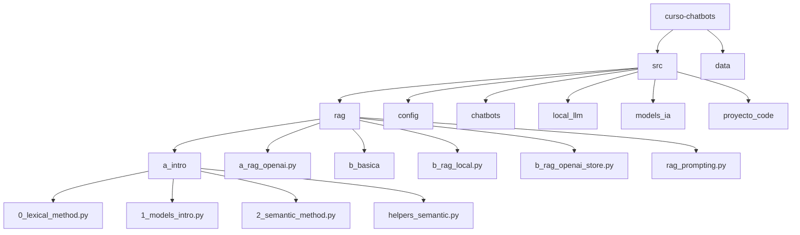

# Curso de Chatbots - Implementaciones RAG

Este repositorio contiene varias implementaciones de RAG (Retrieval Augmented Generation) con diferentes configuraciones y niveles de complejidad.

## ¿Qué es RAG?

RAG (Retrieval Augmented Generation) es una técnica que combina la recuperación de información (Retrieval) con la generación de texto mediante modelos de lenguaje (Generation). Permite a los modelos generar respuestas basadas en información específica recuperada de una base de conocimiento, mejorando la precisión y relevancia de las respuestas.

## Estructura del Proyecto



## Implementaciones RAG Disponibles

### 1. RAG con OpenAI (Versión Básica)

**Archivo**: `src/rag/a_rag_openai.py`

Esta implementación básica de RAG utiliza OpenAI y LangChain, incluyendo:
- Carga de documentos (Alice en el País de las Maravillas)
- División de texto en chunks
- Generación de embeddings con OpenAI
- Almacenamiento en base de datos vectorial FAISS
- Búsqueda por similitud
- Configuración del retriever
- Configuración del LLM (OpenAI)
- Construcción del pipeline RAG
- Consultas al sistema

Esta es la implementación recomendada para comenzar a entender RAG de forma práctica.

### 2. RAG con LLM Local

**Archivo**: `src/rag/b_rag_local.py`

Implementación que usa un modelo de Hugging Face en lugar de OpenAI, manteniendo la misma estructura RAG básica. Ideal para entornos donde se prefiere no depender de APIs externas.

### 3. RAG con OpenAI usando LCEL

**Archivo**: `src/rag/b_rag_openai_store.py`

Una implementación más moderna que utiliza LangChain Expression Language (LCEL) con tuberías de operadores (`|`). Representa un enfoque más declarativo y modular para construir sistemas RAG.

### 4. RAG con Prompting Estructurado

**Archivo**: `src/rag/rag_prompting.py`

Esta implementación usa una clase `RAGChatbot` bien organizada y tiene un mejor manejo de prompts y logging. Ofrece un enfoque más estructurado y escalable para implementaciones en producción.

## Conceptos Fundamentales de RAG

En el directorio `src/rag/a_intro/` encontrarás archivos que explican los conceptos básicos:

- **Búsqueda Léxica** (`0_lexical_method.py`): Implementación utilizando BM25 para búsqueda basada en palabras clave.

- **Introducción a Modelos** (`1_models_intro.py`): Conceptos básicos sobre modelos de lenguaje y embeddings.

- **Búsqueda Semántica** (`2_semantic_method.py`): Implementación de búsqueda basada en embeddings para capturar el significado semántico.

## Cómo Empezar

1. Instala las dependencias:
   ```
   pip install -r requirements.txt
   ```

2. Configura tus claves de API en el archivo `.env` (basado en `.env_template`).

3. Ejecuta cualquiera de las implementaciones RAG:
   ```
   python -m src.rag.a_rag_openai
   ```

## Recomendaciones

Si estás comenzando con RAG:
1. Empieza con `a_rag_openai.py` para entender los componentes básicos
2. Explora los conceptos fundamentales en el directorio `a_intro`
3. Progresa hacia implementaciones más complejas como `rag_prompting.py`

---

Desarrollado por Datoscout para el curso de Chatbots.
