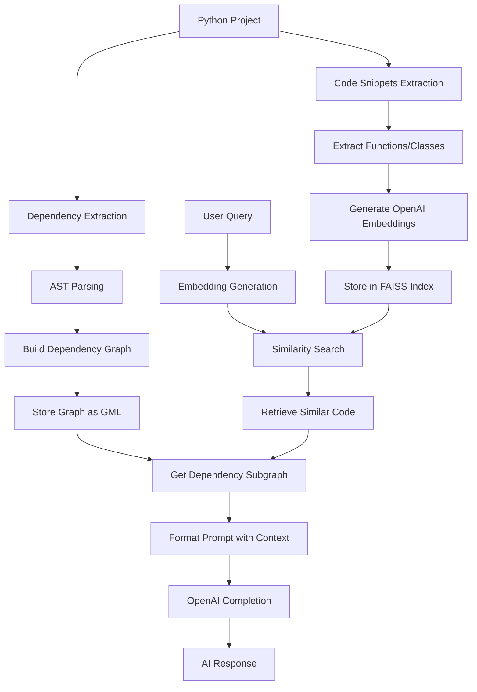
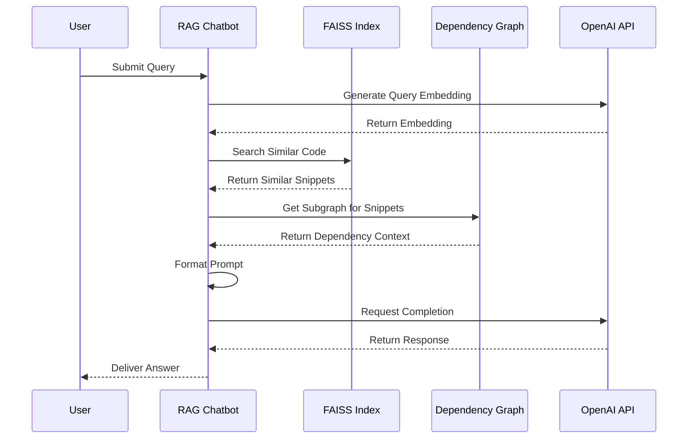

# RAG-Powered Code Assistant for Python Projects

This project enhances code generation, debugging, and refactoring using a **Retrieval-Augmented Generation (RAG) system** tailored for Python projects. The system extracts dependencies, computes embeddings, and enables efficient code retrieval for AI-powered assistance.

## System Architecture



## How It Works

The system operates in three main phases:

### 1. Dependency Extraction & Graph Building

The system analyzes your Python project's source code to extract relationships between functions, classes, and modules:

- Uses Python's **Abstract Syntax Tree (AST)** to parse source files
- Identifies functions, classes, and their relationships
- Builds a directed graph using **NetworkX** where:
  - Nodes represent functions, classes, and modules
  - Edges represent calls, inheritance, or imports
- Saves the dependency graph in GML format for later use

### 2. Code Embedding Generation

Next, the system processes code snippets to create vector representations:

- Extracts relevant code elements (functions, classes) based on the dependency graph
- Generates embeddings for each snippet using **OpenAI's embedding models**
- Normalizes embeddings for cosine similarity comparisons
- Stores embeddings in a **FAISS vector index** alongside metadata
- Metadata includes file path, code type (function/class), and name

### 3. Retrieval & Response Generation

When a user submits a query:

- The query is converted to an embedding using the same model
- The system searches the FAISS index for similar code snippets
- It retrieves a subgraph of dependencies for the matching code
- Retrieved code and dependencies provide context for the AI
- OpenAI's completion models generate a contextually-aware response

## Key Components

### CoderAI Class

The `CoderAI` class is the core component managing the entire workflow:

- **Initialization**: Sets up data structures and loads or creates embeddings
- **Dependency Analysis**: Extracts code structure and relationships
- **Embedding Generation**: Creates vector representations of code snippets
- **Similarity Search**: Finds relevant code based on semantic similarity
- **Response Generation**: Produces AI answers based on retrieved context

### Vector Storage with FAISS

The system uses Facebook AI Similarity Search (FAISS) to efficiently store and query embeddings:

- Uses inner product (cosine similarity for normalized vectors)
- Enables fast retrieval of semantically similar code
- Scales well to large codebases with thousands of functions

### Prompt Engineering

Carefully crafted prompts combine:

- Project-specific context (retrieved code snippets)
- Dependency information
- Project structure
- User query

This ensures the AI responses are relevant and grounded in your actual codebase.

## Usage

The system can be used for various code-related tasks:

- **Code Exploration**: Find relevant functions/classes in unfamiliar codebases
- **Documentation Generation**: Create documentation based on actual code
- **Debugging Assistance**: Get context-aware help for fixing issues
- **Refactoring Suggestions**: Receive recommendations based on project patterns

## Technical Requirements

- Python 3.8+
- OpenAI API key
- Required packages: `networkx`, `faiss-cpu`, `openai`, `loguru`, etc.

## Setup and Configuration

1. **Installation**:
   ```bash
   pip install -r requirements.txt
   ```

2. **Configuration**:
   - Update your API keys in the settings file
   - Configure paths for your project

3. **Running**:
   ```python
   from proyecto_code.code_embeddings import CoderAI

   # Initialize with your project path
   coder = CoderAI("/path/to/your/project")

   # Query the system
   response = coder.generate_answer("How does function X work?")
   print(response.response)
   ```

---

# RAG Chatbot for Project Code Retrieval

## Overview

This feature extends our RAG-Powered Code Assistant by integrating a Retrieval-Augmented Generation (RAG) chatbot. It leverages the project's dependency graph and OpenAI embeddings—previously extracted and stored in a FAISS vector store—to retrieve real code elements (functions, classes, etc.) and provide context-aware answers using OpenAI's completion models.

## Architecture



## Key Features

- **Real Project Context:**
  Uses a dependency graph to extract genuine code elements from your project. These elements are embedded using OpenAI models and stored in a FAISS index.

- **Pre-Generated FAISS Vector Store:**
  Instead of rebuilding the vector base each time, the chatbot loads a pre-generated FAISS index (and associated metadata) from a specified path.

- **RAG Integration with OpenAI:**
  Combines the retrieved code context with a structured prompt to guide OpenAI models in answering questions about your project's code.

- **Customizable Retrieval & Prompt:**
  Uses configurable retrieval parameters for enhanced search relevance and a structured prompt template that strictly bases answers on the retrieved code snippets.

## Setup and Configuration

1. **Prerequisites:**
   - Python 3.8+
   - Required packages: `faiss-cpu`, `openai`, `networkx`, `loguru`, etc.
   - A valid OpenAI API key for both completion and embedding models.

2. **Configuration:**
   - Update the settings file with your credentials:
     ```python
     OPENAI_API_KEY = "your-openai-api-key"
     OPENAI_COMPLETIONS_MODEL = "gpt-3.5-turbo"  # or your preferred model
     OPENAI_EMBEDDINGS_MODEL = "text-embedding-ada-002"  # or compatible model
     DATA_PATH = Path("./data")  # Where to store indexes and graphs
     ```

## Usage Examples

```python
from proyecto_code.code_embeddings import CoderAI

# Initialize with your project path
project_path = "/path/to/your/project"
coder = CoderAI(project_path)

# Example 1: Find code related to a specific feature
snippets = coder.search_similar_code("handle API requests", top_k=3)

# Example 2: Generate documentation for a class
query = """
    Make the documentation for the DatabaseHandler class.
    Consider all the given information.
"""
response = coder.generate_answer(query)
print(response.response)
print(response.code_snippet)
```

## Troubleshooting

- **Vector Store Loading Errors:**
  Confirm that the FAISS index file exists at the specified path.

- **API Key Issues:**
  Verify your OpenAI API key and ensure that your account has the necessary permissions.

- **Low Retrieval Quality:**
  If the retrieved context seems insufficient, review your dependency extraction and code embedding processes for completeness.
